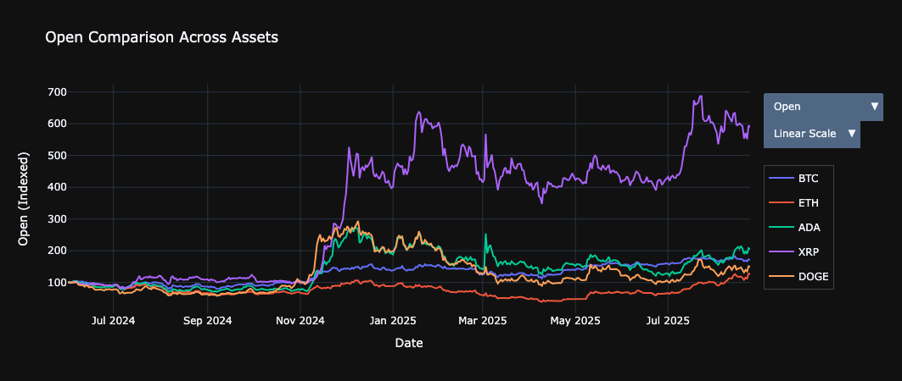

# Summary

Sirifi is a Python package designed for cryptocurrency research, offering a systematic workflow that transforms raw market and community data into actionable insights. It supports robust data processing, technical feature generation, value evaluation, sentiment-informed analysis, and algorithmic trading. The package is user-friendly, allowing customizable intervals, historical ranges, data sources, and filters such as minimum market capitalization or symbol limits. By integrating financial metrics, community sentiment, and automated trading strategies, Sirifi connects academic research with practical cryptocurrency trading.

# Statement of Need

As cryptocurrency markets expand, new opportunities arise for research and trading. Yet, most existing tools are fragmented, forcing users to piece together multiple libraries for data collection, feature engineering, backtesting, and automation. Sirifi addresses this challenge by providing a unified framework that integrates data streaming, feature generation, visualization, sentiment analysis, value assessment, backtesting, and trading automation.

Integrating technical indicators with social sentiment signals [@hutto2014vader; @lupu2025sentiment; @jung2025bitcoin], Sirifi enables a structured approach to evaluating digital assets. Its modular design accommodates both exploratory research and practical algorithmic trading, providing a versatile platform for quantitative analysis and experimentation.

# Functionality

Sirifi consists of six main components. The **data streaming** module collects historical and real-time data from Binance and Yahoo Finance, allowing users to customize intervals, historical depth, symbols, and filters such as market capitalization and liquidity thresholds. The **feature engineering** module cleans raw data and generates technical indicators including percentage returns, moving averages, RSI, MACD, and Bollinger Bands, supporting both research and strategy development [@mantilla2023feature; @riabykh2025entropy].  

The **dashboard** offers interactive visualizations, allowing users to compare indicators across assets and toggle specific symbols or metrics.  

Using metrics like CAGR, Sharpe ratio, maximum drawdown, liquidity, and contrarian signals, the **value investing** module calculates a composite score to rank cryptocurrencies [@fama1992cross]. The **sentiment analysis** module integrates market data with Reddit posts, classifying content using VADER [@hutto2014vader] and combining these sentiment scores with market indicators. Future updates will extend this functionality to include sentiment from X (formerly Twitter) and ValuePickr [@valuepickr2025]. Finally, the **backtesting and trading** module evaluates strategies based on RSI and MACD, optimizes parameters for maximum performance, and executes trades on Binance, with support for dry-run simulations and optional Telegram notifications [@mackey2025backtesting].

# Comparing and Contrasting Available Toolsets

Several existing tools provide valuable functionality but are often specialized and fragmented. While CCXT efficiently connects to exchanges and retrieves market data, it does not provide feature engineering, sentiment analysis, or backtesting functionality. TA-Lib includes a wide range of technical indicators, but users still need external tools for data collection, visualization, or executing trades. Backtrader supports backtesting and strategy evaluation but requires manual implementation of feature engineering and sentiment integration. FinRL offers reinforcement learning strategies for trading, yet it presents a steep learning curve and minimal integration of social sentiment [@saberironaghi2025stock].  

Sirifi distinguishes itself by offering a unified framework that combines data acquisition, feature engineering, visualization, sentiment analysis, value evaluation, backtesting, and automated trading in a single package. It enables interactive exploration of indicators, asset filtering by liquidity or market capitalization, and integration of community sentiment without combining multiple libraries. Multi-threaded computation, dry-run simulations, and Telegram notifications further enhance its practical and research capabilities, positioning Sirifi as a comprehensive platform bridging academic research and real-world trading.

# Figures

{#fig:feature-engineering-dashboard}

# Future Plans

Sirifi will be extended beyond cryptocurrencies to support stock markets, including Indian and American equities. Planned enhancements include integration with additional exchanges, sentiment signals from X (formerly Twitter) and ValuePickr, real-time anomaly detection, predictive modeling with machine learning, advanced portfolio optimization, and enhanced risk management frameworks. These improvements aim to make Sirifi a versatile tool for both research and professional trading.

# Acknowledgements

We are grateful to the open-source community for the tools and APIs that made this work possible. In particular, the Binance API, Yahoo Finance API, praw, and VADER [@hutto2014vader] played a key role in data collection and sentiment analysis.

# References
